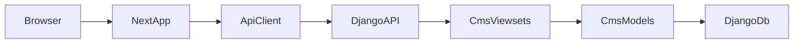

# Django + Next.js CMS

Full-stack CMS with **Django** (backend API / admin) and **Next.js** (frontend).

- **Backend**: Django REST Framework, SQLite (dev), `/backend`
- **Frontend**: Next.js (TypeScript, Tailwind, App Router, shadcn/ui), `/frontend`

## Quick start

### Backend

```bash
cd backend
python -m venv .venv
# Windows (PowerShell): .venv\Scripts\Activate.ps1
# macOS/Linux: source .venv/bin/activate
pip install -r requirements.txt
cp .env.example .env   # edit if needed
python manage.py migrate
python manage.py runserver
```

- API: http://localhost:8000/api/
- Pages list: http://localhost:8000/api/pages/
- Django admin (CMS): http://localhost:8000/admin/ (create a superuser with `python manage.py createsuperuser`)

### Frontend

```bash
cd frontend
pnpm install
cp .env.local.example .env.local   # edit NEXT_PUBLIC_API_URL if backend is not on :8000
pnpm dev
```

- App: http://localhost:3000

## Environment variables

- **Backend** (`backend/.env`): see `backend/.env.example` (e.g. `SECRET_KEY`, `DEBUG`, `ALLOWED_HOSTS`, `CORS_ORIGINS`).
- **Frontend** (`frontend/.env.local`): see `frontend/.env.local.example` (`NEXT_PUBLIC_API_URL` pointing to Django API).

## Project structure

- `frontend/` — Next.js app (App Router, Tailwind, shadcn/ui)
- `backend/` — Django project (`config`), CMS app (`cms`), REST API under `/api/`

### Where things live

- **Backend CMS models and API**: `backend/cms/models.py`, `backend/cms/serializers.py`, `backend/cms/views.py`, `backend/cms/urls.py`
- **Frontend domain types**: `frontend/src/types/cms.ts` (shared `Page` and `BlogPost` shapes)
- **Frontend API layer**:
  - High-level helpers: `frontend/src/lib/api/` (e.g. `blog.ts`, `pages.ts`, and barrel `api.ts`)
  - Low-level HTTP client: `frontend/src/lib/api/client.ts`
  - API base URL config: `frontend/src/lib/env.ts` (`API_BASE` from `NEXT_PUBLIC_API_URL`)

## Architecture overview



## Sample data

To load example blog posts for local development, run:

```bash
cd backend
python manage.py loaddata blog_posts
```
